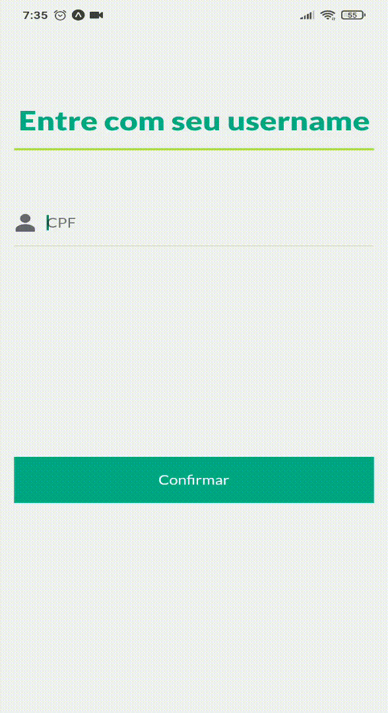

<p align="center">
  
  
  <a href="https://github.com/danielwsilva/maisTodos/commits/master">
    
  </a>
  
  

  <a href="https://github.com/danielwsilva">
    
  </a>
</p>

<h1 align="center">
  <br> 
</h1>

## 💻 Sobre o projeto

A aplicação tem a finalidade de mostrar o saldo e movimentações dos cliente nas suas respectivas MAISContas.

## 🧭 Rodando a aplicação

```bash

# Clone este repositório
$ git clone https://github.com/danielwsilva/maisTodos.git

# Acesse a pasta do projeto no seu terminal/cmd
$ cd maisTodos

# Instale as dependências
$ yarn

# Execute a aplicação em modo de desenvolvimento
$ expo start

```

## 🛠 Tecnologias

Bibliotecas envolvidas na construção do projeto:

#### React Native - Bibliotecas

- **react-navigation** - Navegação (Stack e Button Tab)
- **styled-components** - CSS in JS
- **axios** - Requisições API
- **expo-google-fonts** - Importação de fonts
- **react-native-gesture-handler** - Componentes com comportamento Nativo
- **react-native-iphone-x-helper** - Ajuda a projetar quando o smartphone tem entalhos
- **react-native-responsive-fontsize** - Fontes responsivas
- **masked-view** - Aplicar máscara nos inputs
- **intl** - Configurar a internacionalização
- **date-fns** - Manipulação de datas

<a name="-autor"></a>

## 🦸‍♂️ **Autor**

<p>
<kbd>
 
 </kbd>
 <br />
 <sub><strong>🌟 Daniel Wallace 🌟</strong></sub>
</p>

[](https://www.linkedin.com/in/daniel-wallace-1b9280b2/)
[](mailto:danielwllacec@gmail.com)

---

## 📝 Licença

Este projeto esta sobe a licença [MIT](./LICENSE).

Feito com :satisfied: por Daniel Wallacec 👋🏽 [Entre em contato!](https://www.linkedin.com/in/daniel-wallace-1b9280b2/)

---
